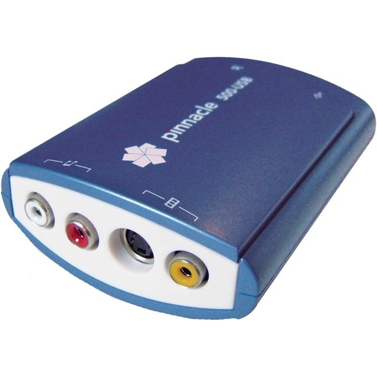
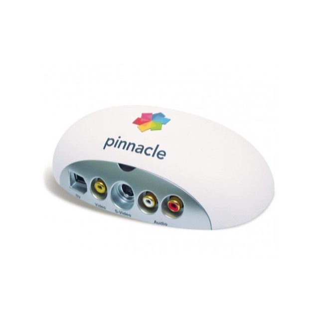
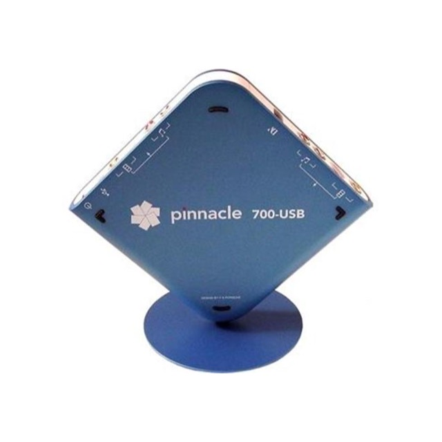
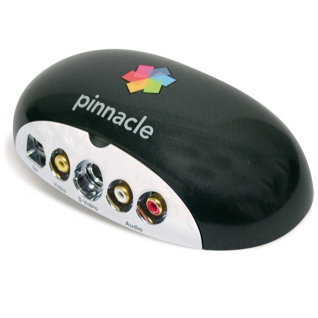
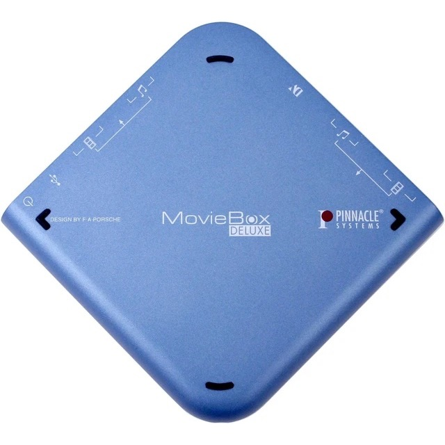

<p align="center"></p>

<h1 align="center">MarvinCapture</h1>
<p align="center"><b>An open-source user-space driver application for  DV and analog video using Pinnacle MovieBox USB "Marvin" capture devices.</b></p>

## Background

DV video from tape is increasingly hard to capture (ingest) on modern systems, on Windows 10 it still works, but all the existing hardware / driver / software combinations make it quite a buggy and frustrating experience. MacOS 26 has dropped support for FireWire entirely.

This is an attempt to fix that, by writing a new, modern, cross platform integrated driver and user-space capture application, targeting Pinnacle's MovieBox series of USB capture devices which feature a FireWire input for DV, in addition to analog.

These devices implement a lossless DV-to-USB bridge, i.e. the box **does not** perform any kind of compression or conversion. The DV data you get is what was sent by the camera. Performance is very reliable, the devices do not have any data loss or audio desync issues (test methodology below).

These are no longer made, although they are still available on second-hand markets, usually for reasonable prices (30-50€).

Pinnacle's driver internally calls these "Marvin", hence the naming.

## Features

Modern, native GUIs for Windows and Mac, plus a flexible command-line application for Windows, Mac, and Linux, allowing video capture to various file formats, with options mostly focused on high quality archival and preservation.

[screenshot windows and mac]

* Native applications for Mac/Windows
* Command-line interface for Mac/Windows/Linux, exposing all features that the GUI has and designed for use in automated piplelines, exposing deck controls/capture actions, and timeouts. The GUI can also be launched via command line and given configuration and actions to execute.
* Both sharing a user-space LibUSB based driver.
* Support for multiple instances at a time, each instance can connect to a different device.
* DV capture, (dv/avi/mov)
* HDV capture, including devices which Pinnacle didn't market as supporting it. (ts/m2t/mov/mkv)
* Composite / S-video capture, to uncompressed AVI or FFV1 in MKV. YUY2 video (4:2:2, 8-bit) and 48 kHz stereo PCM, 16-bit.
* Scene-splitting by timecode (DV/HDV)
* Auto-stop (timeout) on no input signal signal (DV/HDV/analog)
* Auto-stop after total time captured (DV/HDV/analog)
* Automatic multiple capture-passes, intended for use with tools such as [DVrescue's DVmerge](https://mipops.github.io/dvrescue/sections/merge.html) allowing for error reduction by picking error free blocks from multiple captures. (DV/HDV)
* Deck control, FF, REW, Play, Pause, (DV/HDV)
* Manual capture withoug use of deck control. (DV/HDV/analog)
* Automatic capture, rewind tape, start playback and capture. (DV/HDV)
* Lots of status info, error % (DV/HDV), disk space info, full-quality live audio and video preview, and lots of other stuff.

## Supported hardware:

|  | PID | internal name | model no | status |
|---|---|---|---|---|
| <a href="docs/images/500-usb.jpg"></a> | `0213` | Marvin-Lite | **500-USB** | supported, tested, DV/HDV/analog in |
| <a href="docs/images/510-usb.jpg"></a> | `0223` | Marvin-510 | **510-USB** | supported, tested, DV/HDV/analog in |
| <a href="docs/images/700-usb.jpg"></a> | `0212` | Marvin-CR | **700-USB** | **untested** (but probably works) |
| <a href="docs/images/710-usb.jpg"></a> | `0224` | Marvin-710 | **710-USB** | **untested** (but probably works) |
| <a href="docs/images/moviebox-deluxe.jpg"></a> | `0206` | Marvin-classic | **MovieBox Deluxe** | **untested** (less likely to work) |

These boxes were variously sold as Pinnacle Studio MovieBox USB, Pinnacle Studio MovieBox HD, Pinnacle Studio MovieBox Ultimate, Pinnacle Studio MovieBox Plus, and possibly others, with variations in which combinations of hardware and software were included.

The 710-USB/510-USB is supposedly the best for analog, according to some forum threads.

Pinnacle also made some devices which are not supported:

* **MovieBox DV**: Analog to DV converter box, lacking USB. This one has a square shape similar to the 700 and deluxe, in silver.
* **MovieBox USB**, **Dazzle**: Analog to USB, no DV inputs. Also available in a square shape, or triangle with attached USB cable, don't buy any of these for use with this project.

More details in [docs/hardware.md](docs/hardware.md). (of interesting note: the device implements a standard OHCI-1394 host controller on an FPGA, it can likely work with any Firewire-100 device and likely isn't limited to DV, although this project focuses on DV video)

## Reliability, performance & correctness

For best performance & reliability, the following are recommended (The GUI and CLI will also warn you about them):

### All systems:

Connect the device directly to a USB root port, not via a hub, to ensure it doesn't have to share bandwidth with other devices. The GUI and CLI will warn you when a potential hub connection is detected. You can also use a utlity like [usbtreeview](https://www.uwe-sieber.de/usbtreeview_e.html) (Windows) to check your USB ports.

### Linux:

Requires adding udev rule allowing the application disable the CPU C3 deep sleep / idle states.

* `echo 'KERNEL=="cpu_dma_latency", MODE="0666"' | sudo tee /etc/udev/rules.d/99-cpu-dma-latency.rules`
* `sudo udevadm control --reload && sudo udevadm trigger /dev/cpu_dma_latency`

### MacOS

"Just works".

### Windows

Recommended to set power plan to "performance".

### Background

In my experience with writing and using this, this is already far more reliable, bug-free, and pleasant to use than all existing pure-firewire based DV capture solutions. No more random deck not detected and reboot required to get it back...

This has also been **extensively tested for correctness**, here meaning not losing data.

This is done with a Test-DVD containing QR codes, one per frame, encoding the frame number, and [Linear Timecode](https://en.wikipedia.org/wiki/Linear_timecode), also encoding the frame number, each frame looks like this:

<a href="docs/images/qr-code-frame.png"></a>

We can play this DVD in a DVD player, with the output connected to the capture device under test. With this project, over a 60 minute test, both on analog inputs, and on DV (via a camcorder in "AV to DV" mode), we have 0 frames lost (frames missing, that are expected to be there), and 0ms of audio missing (undecodable by [LTCdump](https://github.com/x42/ltc-tools/blob/master/ltcdump.c)), and no audio sync drift of more than 1 frame in either direction.

This capture device is, in my testing so far, the only USB device and software that fully passes this test. (The pinnacle devices lock the sample clock to the incoming video clock, and do not drop or duplicate frames to resample the framerate). 

(Note that this test DVD generation, and testing tool is not part of this repo).

Note that the usual recommendation regarding USB devices still applies: avoid connecting it on a hub where it shares bandwidth with other devices (the UI and CLI will warn if it detects a hub). Although this is much less of an issue with DV than with analog, since the bitrate of DV is 25Mbps, which has plenty of margin with USB2's 480Mbps.

This readme, interface design, testing, and verification are all made by a human. However, reverse engineering of the manufacturer's driver, and this code, was made possible with extensive use of LLMs.

## Contributing

Pull requests are welcome, notes:
* AI-written code is acceptable, however it must have been tested by a human, for correctness and functionality.
* If you add support for new hardware, you must test with that hardware.
* If you add support for new output formats or any other features, you must test them thoroughly.

## Build

```powershell
scripts\build.ps1
```

builds everything (needs MSYS2 UCRT64 and the .NET 10 SDK; see
[docs/building.md](docs/building.md)) into `build\windows-x86_64\dist`:

```
build\windows-x86_64\dist\MarvinCaptureGUI.exe        the GUI
build\windows-x86_64\dist\MarvinCaptureCLI.exe        the command-line program
build\windows-x86_64\dist\marvin-core.dll             the core library
build\windows-x86_64\dist\firmware\                   FPGA bitstreams
```

On macOS, `bash scripts/build.sh` builds everything (needs the Xcode Command
Line Tools and Homebrew's cmake, ninja, nasm, libusb and pkgconf; no Xcode) into
`build/macos-arm64/dist`:

```
build/macos-arm64/dist/MarvinCapture.app              the GUI (core, libusb and firmware inside)
build/macos-arm64/dist/MarvinCaptureCLI               the command-line program
build/macos-arm64/dist/libmarvin-core.dylib           the core library
build/macos-arm64/dist/firmware/                      FPGA bitstreams
```

On Linux, `bash scripts/build.sh` builds the core and `MarvinCaptureCLI` into
`build/linux-x86_64/dist` (there is no Linux GUI yet).

The device has to be bound to WinUSB, not the vendor driver
([docs/windows-driver.md](docs/windows-driver.md)). Then either run
`MarvinCaptureGUI.exe`, or from `build\windows-x86_64\dist`:

```powershell
.\MarvinCaptureCLI.exe                                   # help and the device list
.\MarvinCaptureCLI.exe --rew --wait --play --capture out.dv --wait --rew --wait
.\MarvinCaptureCLI.exe -i composite --capture out.avi --wait wallclock=00:01:00   # analog, 60 s
```

## Software architecture

```
MarvinCaptureGUI (WinUI 3)  ──┐
MarvinCapture.app (macOS)   ──┼──▶  marvin-core  (marvin-core.dll / libmarvin-core.dylib / .so,
MarvinCaptureCLI            ──┘                   src/api/pin_api.h)
                                       └─ session engine (src/engine), file writers (src/sinks)
                                       └─ hardware layer (src/core) ──▶ libusb ──▶ device
```

## Documentation

| | |
|---|---|
| [docs/building.md](docs/building.md) | Build script, output layout, tests, repository layout |
| [docs/usage.md](docs/usage.md) | Running captures, diagnostics, proving no data was dropped |
| [docs/hardware.md](docs/hardware.md) | USB descriptors, endpoints, initialisation, what the FPGA is |
| [docs/protocol.md](docs/protocol.md) | Command word, OHCI access, EP 0x88 framing |
| [docs/startup.md](docs/startup.md) | Plug-in to first stream byte, step by step |
| [docs/deck-control.md](docs/deck-control.md) | AV/C deck control |
| [docs/hdv.md](docs/hdv.md) | HDV capture |
| [docs/analog.md](docs/analog.md) | Analog capture, other Marvin models, the three bitstreams |
| [docs/windows-driver.md](docs/windows-driver.md) | Switching the device to WinUSB |
| [gui/windows/README.md](gui/windows/README.md) | The Windows GUI |
| [gui/macos/README.md](gui/macos/README.md) | The macOS GUI |

Note this documentation was written by an LLM, primarily for other LLM usage.

## Licence

**GNU Affero General Public License v3.0** ([LICENSE](LICENSE)). If you run a
modified version of this code as a network service, you must offer its source to
that service's users.

The FPGA bitstreams are **excluded** from that grant; they are not ours to
license. FFmpeg is linked statically under LGPL-2.1+ ([third_party/README.md](third_party/README.md)).


### FPGA bitstreams

`firmware/fpga-ohci.bin` (DV/HDV) and `firmware/fpga-capture.bin` (analog) are
**Pinnacle's copyright, not ours.** They are static Altera Cyclone EP1C3
configuration blobs extracted from the vendor driver, and the hardware is inert without them. They are included as a pragmatic decision: the device was discontinued around 2005, the vendor driver is no longer distributed or supported, and without them this repository would be useless to anyone who owns the hardware. No claim of ownership is made and no licence is granted by this repository. See [firmware/README.md](firmware/README.md).

The vendor driver binaries and installer are **not** included.